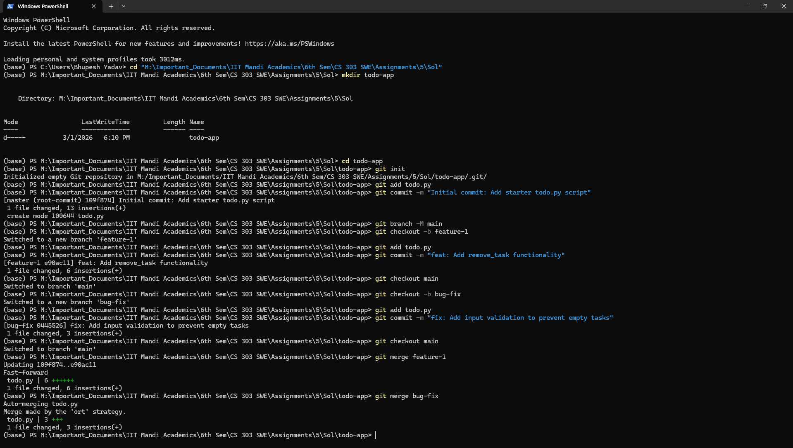

# Configuration Management in Practice
**Task 3: Version Control and Change Management**

## 1. Git Workflow Documentation
* **Branching Strategy:** I utilized a standard feature-branch workflow. `main` serves as the stable production code. `feature-1` was branched off `main` to develop new capabilities, and `bug-fix` was branched off `main` to handle issue resolution in isolation.
* **Feature Development (`feature-1`):** Added a `remove_task` function to allow users to delete tasks from the list.
* **Bug Fixing (`bug-fix`):** Modified the `add_task` function to include input validation, preventing the application from accepting empty strings as tasks.
* **Merging:** Checked out the `main` branch and merged `feature-1`, followed by `bug-fix`. 
* **Merge Conflicts:** **None.** Because the changes in `feature-1` (adding a new function at the bottom) and `bug-fix` (modifying an existing function at the top) altered different lines of the `todo.py` file, Git's auto-merge algorithms successfully integrated the code without conflicts.

## 2. Commit History Log
Below is the log of the commit history demonstrating the isolated development and subsequent merges:


- Terminal Logs - 

Screenshot - 


- Pasted text from terminal - 
```
(base) PS M:\Important_Documents\IIT Mandi Academics\6th Sem\CS 303 SWE\Assignments\5\Sol> mkdir todo-app


    Directory: M:\Important_Documents\IIT Mandi Academics\6th Sem\CS 303 SWE\Assignments\5\Sol


Mode                 LastWriteTime         Length Name
----                 -------------         ------ ----
d-----          3/1/2026   6:10 PM                todo-app


(base) PS M:\Important_Documents\IIT Mandi Academics\6th Sem\CS 303 SWE\Assignments\5\Sol> cd todo-app

(base) PS M:\Important_Documents\IIT Mandi Academics\6th Sem\CS 303 SWE\Assignments\5\Sol\todo-app> git init
Initialized empty Git repository in M:/Important_Documents/IIT Mandi Academics/6th Sem/CS 303 SWE/Assignments/5/Sol/todo-app/.git/

(base) PS M:\Important_Documents\IIT Mandi Academics\6th Sem\CS 303 SWE\Assignments\5\Sol\todo-app> git add todo.py

(base) PS M:\Important_Documents\IIT Mandi Academics\6th Sem\CS 303 SWE\Assignments\5\Sol\todo-app> git commit -m "Initial commit: Add starter todo.py script"
[master (root-commit) 109f874] Initial commit: Add starter todo.py script
 1 file changed, 13 insertions(+)
 create mode 100644 todo.py

(base) PS M:\Important_Documents\IIT Mandi Academics\6th Sem\CS 303 SWE\Assignments\5\Sol\todo-app> git branch -M main

(base) PS M:\Important_Documents\IIT Mandi Academics\6th Sem\CS 303 SWE\Assignments\5\Sol\todo-app> git checkout -b feature-1
Switched to a new branch 'feature-1'

(base) PS M:\Important_Documents\IIT Mandi Academics\6th Sem\CS 303 SWE\Assignments\5\Sol\todo-app> git add todo.py

(base) PS M:\Important_Documents\IIT Mandi Academics\6th Sem\CS 303 SWE\Assignments\5\Sol\todo-app> git commit -m "feat: Add remove_task functionality"
[feature-1 e90ac11] feat: Add remove_task functionality
 1 file changed, 6 insertions(+)

(base) PS M:\Important_Documents\IIT Mandi Academics\6th Sem\CS 303 SWE\Assignments\5\Sol\todo-app> git checkout main
Switched to branch 'main'

(base) PS M:\Important_Documents\IIT Mandi Academics\6th Sem\CS 303 SWE\Assignments\5\Sol\todo-app> git checkout -b bug-fix
Switched to a new branch 'bug-fix'

(base) PS M:\Important_Documents\IIT Mandi Academics\6th Sem\CS 303 SWE\Assignments\5\Sol\todo-app> git add todo.py

(base) PS M:\Important_Documents\IIT Mandi Academics\6th Sem\CS 303 SWE\Assignments\5\Sol\todo-app> git commit -m "fix: Add input validation to prevent empty tasks"
[bug-fix 0445526] fix: Add input validation to prevent empty tasks
 1 file changed, 3 insertions(+)

(base) PS M:\Important_Documents\IIT Mandi Academics\6th Sem\CS 303 SWE\Assignments\5\Sol\todo-app> git checkout main
Switched to branch 'main'

(base) PS M:\Important_Documents\IIT Mandi Academics\6th Sem\CS 303 SWE\Assignments\5\Sol\todo-app> git merge feature-1
Updating 109f874..e90ac11
Fast-forward
 todo.py | 6 ++++++
 1 file changed, 6 insertions(+)

(base) PS M:\Important_Documents\IIT Mandi Academics\6th Sem\CS 303 SWE\Assignments\5\Sol\todo-app> git merge bug-fix
Auto-merging todo.py
Merge made by the 'ort' strategy.
 todo.py | 3 +++
 1 file changed, 3 insertions(+)
```

I will run the following commands now - 

1. To commit README.md - 
```
git add README.md
git commit -m "docs: Add Git workflow documentation"
```

2. To get a public github URL -
```
git remote add origin https://github.com/Bhupesh-Khordia/todo-app

git push -u origin --all
```

## 3. Final `todo.py` in main branch

```python
tasks = []
def add_task(task):
    if not task.strip():
        print("Error: Cannot add an empty task.")
        return
    tasks.append(task)
    print(f'Task "{task}" added.')
def list_tasks():
    if not tasks:
        print("No tasks available.")
    else:
        for idx, task in enumerate(tasks, start=1):
            print(f'{idx}. {task}')
def remove_task(task):
    if task in tasks:
        tasks.remove(task)
        print(f'Task "{task}" removed.')
    else:
        print(f'Task "{task}" not found.')
if __name__ == "__main__":
    add_task("Finish Assignment")
    list_tasks()

```